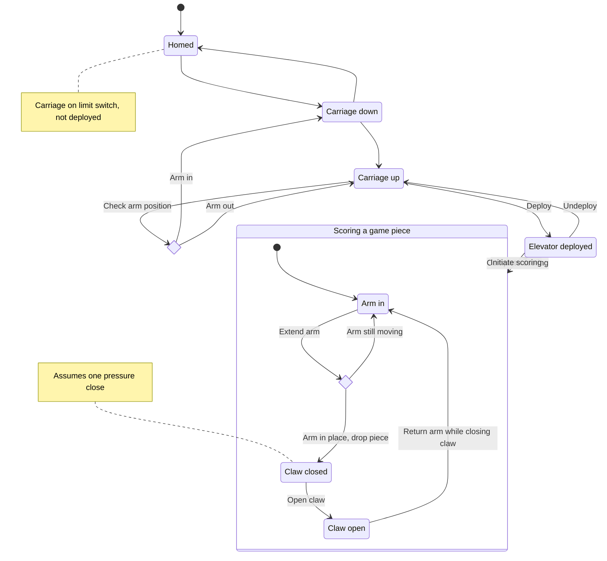
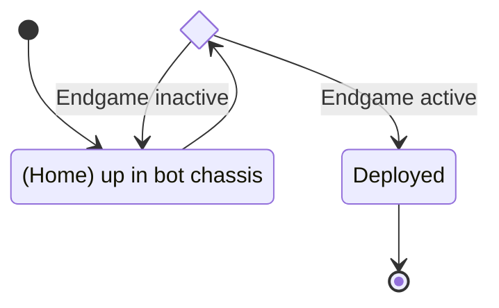

# State Diagrams for Robot Assemblies

[Back to Project Documentation](../)

## Elevator-Arm-Claw Assembly State Diagram

```mermaid
stateDiagram-v2
    home: Homed
    state arm_position <<choice>>
    down: Carriage down
    up: Carriage up
    deployed: Elevator deployed
    in: Arm in
    open: Claw open
    closed: Claw closed

    note right of home
        Carriage on limit switch, not deployed
    end note
    [*] --> home
    home --> down
    down --> home
    down --> up

    scoring: Scoring a game piece
    state scoring {
        note left of closed: Assumes one pressure close
        state arm_in_position <<choice>>
        [*] --> in
        in --> arm_in_position: Extend arm
        arm_in_position --> closed: Arm in place, drop piece
        arm_in_position --> in: Arm still moving
        closed --> open: Open claw
        open --> in: Return arm while closing claw
    }

    arm_position --> down: Arm in
    arm_position --> up: Arm out
    up --> arm_position: Check arm position
    scoring --> deployed: Complete scoring
    deployed --> up: Undeploy
    up --> deployed: Deploy
    deployed --> scoring: Initiate scoring
```

## Butterfly Wheels State Diagram

```mermaid
stateDiagram-v2
    state endgame <<choice>>
    up: (Home) up in bot chassis
    down: Deployed

    [*] --> up
    up --> endgame
    endgame --> up: Endgame inactive
    endgame --> down: Endgame active
    down --> [*]
```
